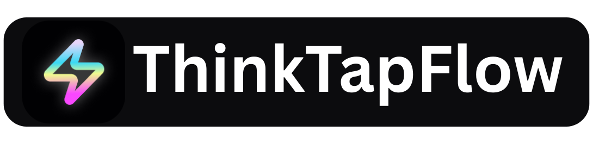

A modern SaaS application for automated content generation powered by AI.

## 📊 ERROR MONITORING

Sentry integration provides:

- Real-time error tracking
- Performance monitoring
- User session replay
- Custom error alerts
- Debug information capture
- Production issue resolution

## 🚀 FEATURES

- AI-Powered Content Generation: Leverage Google's Gemini AI for high-quality content creation
- Multi-Platform Support: Generate content for various social media platforms and use cases
- User Authentication: Secure authentication system with Supabase
- Subscription Management: Integrated billing with Paddle payments
- Content History: Track and manage your generated content
- Responsive Design: Modern UI built with Tailwind CSS and shadcn/ui
- Real-time Analytics: Monitor usage and performance

## 🛠️ TECH STACK

Frontend:
- Next.js 14 (App Router)
- TypeScript
- Tailwind CSS
- shadcn/ui

Backend:
- Next.js API Routes
- Supabase (Database & Authentication)
- Groq AI (Fast AI Inference)
- Paddle (Payments)
- Sentry (Error Monitoring)

📁 PROJECT STRUCTURE

      thinktapflow/
      ├── app/                          # Next.js 14 App Router
      │   ├── (auth)/                   # Auth pages
      │   ├── dashboard/                # Authenticated dashboard routes
      │   ├── pricing/                  # Pricing page
      │   └── api/                      # API route handlers
      ├── components/                   # Reusable UI components
      │   ├── ui/                       # shadcn/ui base
      │   ├── auth/                     # Auth-specific UI
      │   ├── dashboard/                # Dashboard-specific UI
      │   ├── landing/                  # Landing page UI
      │   └── common/                   # General shared components
      ├── lib/                          # Logic (AI, API, social, validations, etc.)
      │   ├── ai/                       # AI Providers and Services
      │   ├── api/                      # API client, errors, validation logic
      │   ├── content/                  # Content extraction services
      │   ├── social/                   # Social post generators
      │   ├── validations/              # Input validations
      ├── hooks/                        # Custom React hooks
      ├── constants/                    # Static constants
      ├── config/                       # Config templates
      ├── public/                       # Static assets (e.g. logo)
      ├── types/                        # Global TypeScript types

## 🏗️ GETTING STARTED

Prerequisites:
- Node.js 18+
- npm or yarn
- Supabase account
- Groq API key
- Paddle account (for payments)
- Sentry account (for error monitoring)

Installation Steps:

1. Clone the repository

         git clone https://github.com/yourusername/thinktapflow.git
         cd thinktapflow

2. Install dependencies
         
         npm install

3. Set up environment variables
   Copy the template from config/env.template.txt and create:
   - .env.local (for development)
   - .env.production (for production)

4. Configure your environment variables (see section below)

5. Set up Supabase
   - Create a new Supabase project
   - Run database migrations
   - Configure authentication providers

6. Run the development server
  
       npm run dev

7. Open your browser
   Navigate to http://localhost:3000

## 🌐 ENVIRONMENT VARIABLES

Required environment variables:

# App Configuration
     
      NEXT_PUBLIC_APP_URL="http://localhost:3000"
      NEXT_PUBLIC_APP_NAME="ThinkTapFlow"

# Supabase Configuration

      NEXT_PUBLIC_SUPABASE_URL="your-supabase-project-url"
      NEXT_PUBLIC_SUPABASE_ANON_KEY="your-supabase-anon-key"
      SUPABASE_SERVICE_ROLE_KEY="your-supabase-service-role-key"

# Groq AI Configuration

      GROQ_API_KEY="your-groq-api-key"

# Sentry Configuration

      SENTRY_DSN="your-sentry-dsn"
      SENTRY_ORG="your-sentry-org"
      SENTRY_PROJECT="your-sentry-project"

# Paddle Configuration

      NEXT_PUBLIC_PADDLE_CLIENT_TOKEN="your-paddle-client-token"
      PADDLE_SECRET_KEY="your-paddle-secret-key"
      PADDLE_WEBHOOK_SECRET="your-paddle-webhook-secret"

## 🔧 AVAILABLE SCRIPTS

      npm run dev       - Start development server
      npm run build     - Build application for production
      npm run start     - Start production server
      npm run lint      - Run ESLint for code linting
      npm run type-check - Run TypeScript type checking

## 🗄️ DATABASE SETUP

The application uses Supabase as the backend. Required tables:

- users: User profiles and metadata
- subscriptions: User subscription information
- generations: Content generation history
- usage_tracking: API usage tracking

## 🔐 AUTHENTICATION

ThinkTapFlow uses Supabase Auth with support for:

- Email/password authentication
- Social logins (Google, GitHub, etc.)
- Password recovery
- Email verification

## 💳 PAYMENT INTEGRATION

Integrated with Paddle for subscription management:

- Multiple subscription tiers
- Secure payment processing
- Webhook handling for subscription events
- Usage-based billing

## 🤖 AI INTEGRATION

Groq AI integration provides:

- Ultra-fast AI inference
- High-quality text generation
- Content optimization
- Multiple content formats
- Customizable generation parameters
- Cost-effective AI processing

## 🚀 DEPLOYMENT

Vercel (Recommended):
1. Push code to GitHub
2. Connect repository to Vercel
3. Configure environment variables in Vercel dashboard
4. Deploy automatically on push to main branch

Other supported platforms:
- Netlify
- Railway
- DigitalOcean App Platform
- AWS Amplify

## 📝 ENVIRONMENT VARIABLES REFERENCE

Variable                          | Description                    | Required
-----------------------------------|--------------------------------|---------
NEXT_PUBLIC_APP_URL               | Your application URL           | Yes
NEXT_PUBLIC_APP_NAME              | Application name               | Yes
NEXT_PUBLIC_SUPABASE_URL          | Supabase project URL          | Yes
NEXT_PUBLIC_SUPABASE_ANON_KEY     | Supabase anonymous key        | Yes
SUPABASE_SERVICE_ROLE_KEY         | Supabase service role key     | Yes
GROQ_API_KEY                      | Groq AI API key               | Yes
NEXT_PUBLIC_PADDLE_CLIENT_TOKEN   | Paddle client token           | Yes
PADDLE_SECRET_KEY                 | Paddle secret key             | Yes
PADDLE_WEBHOOK_SECRET             | Paddle webhook secret         | Yes
SENTRY_DSN                        | Sentry DSN for error tracking | Yes
SENTRY_ORG                        | Sentry organization           | Yes
SENTRY_PROJECT                    | Sentry project name           | Yes

## 🤝 CONTRIBUTING

1. Fork the repository
2. Create a feature branch (git checkout -b feature/amazing-feature)
3. Commit your changes (git commit -m 'Add some amazing feature')
4. Push to the branch (git push origin feature/amazing-feature)
5. Open a Pull Request

## 📄 LICENSE

This project is licensed under the MIT License - see the LICENSE file for details.

## 🆘 SUPPORT

If you encounter issues:

1. Check the Issues page on GitHub
2. Create a new issue if your problem isn't already reported
3. Provide detailed information about your environment and the issue

## 🙏 ACKNOWLEDGMENTS

- Next.js - The React framework
- Supabase - Backend as a Service
- Tailwind CSS - Utility-first CSS framework
- shadcn/ui - Beautiful UI components
- Groq - Fast AI inference platform
- Paddle - Payment infrastructure
- Sentry - Error monitoring and performance tracking

Built with ❤️ by the ThinkTapFlow team